# ConfigUI

A local-only web UI for managing the defcon.run infrastructure configuration. ConfigUI reads and writes `site.hcl`, `service.hcl`, `env.sh`, and `env.local.sh` files, provides live HCL preview with syntax highlighting, runs `terragrunt plan/apply` with streaming terminal output, and shows real-time AWS resource discovery.

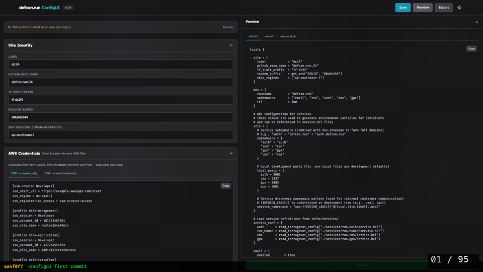

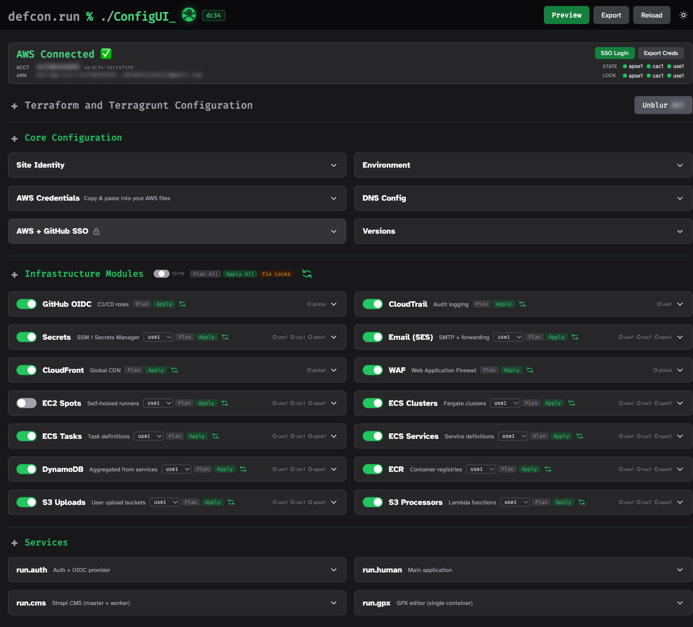

## Quick Start

```bash
cd apps/configui
go build -o configui .
./configui              # Opens browser automatically
./configui --no-browser # Start without opening browser
```

ConfigUI listens on a random port on `127.0.0.1` and prints the URL. Press **Enter twice** (within 500ms) in the terminal to reload configuration from disk.

## Features

### Form Panels

Three collapsible sections organize 24+ configuration panels:

**Core Configuration** -- Site identity, DNS, environment variables, AWS credentials, and service versions.

**Infrastructure Modules** -- Toggle-able panels for each Terraform module: GitHub OIDC, CloudTrail, Secrets Manager, Email (SES), CloudFront, WAF, EC2 Spots, ECS Clusters/Tasks/Services, DynamoDB, ECR, S3 Uploads, and Upload Processors.

**Services** -- Per-service configuration for run.auth, run.human, run.cms, and run.gpx with container sizing, DynamoDB tables, S3 buckets, Lambda functions, and autoscaling.

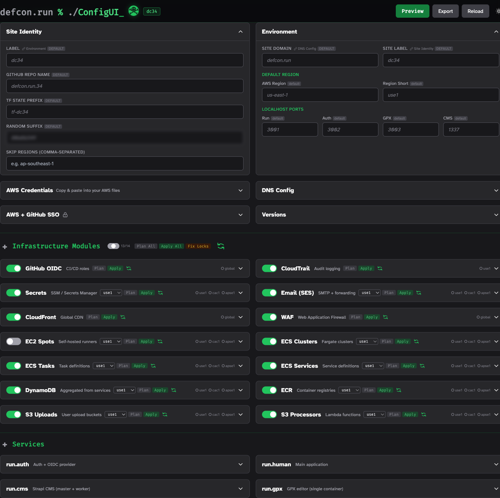

### Module Toggle with Status Label

Each infrastructure module has an enable/disable toggle. The section header has a tri-state slider showing **all**, **none**, or a count like **5/12** to indicate how many modules are active.

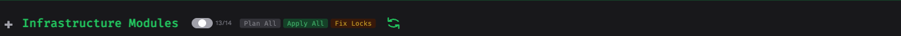

### Live HCL Preview

Click **Preview** to open a resizable side panel showing the generated `site.hcl`, `service.hcl` (per service), `env.sh`, and `env.local.sh` files in tabbed view. The preview updates live as you edit form fields.

- Syntax highlighting for HCL (comments, strings, interpolations, numbers, booleans, functions)
- Code folding on blocks and arrays
- Copy to clipboard per tab
- Draggable resize handle between form and preview

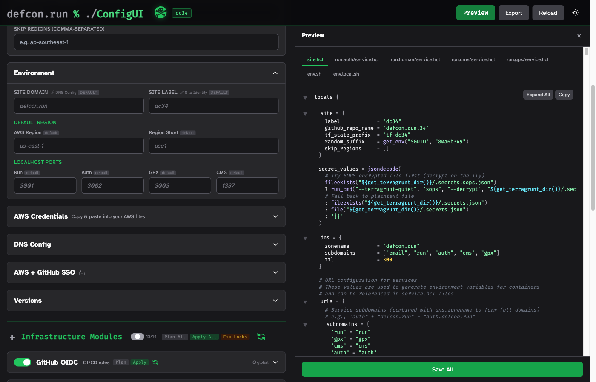

### AWS Status Bar

Shows current AWS authentication state with account ID, ARN, SSO Login and Export Creds buttons. Below the buttons, status dots indicate Terraform state bucket and lock table health per region.

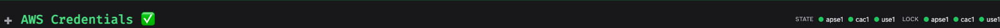

### Discovery Dots

Each infrastructure module panel header shows per-region status dots indicating whether the resource exists in AWS:

- Green dot -- resource found
- Hollow dot -- resource missing
- Amber dot -- partial (some sub-resources found)
- Spinning dot -- currently checking

Dots auto-refresh on page load and after terminal commands complete. Click the refresh button to manually re-scan.

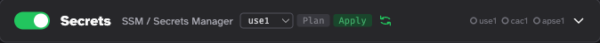

### Terminal (Terragrunt Execution)

Click **Plan** or **Apply** on any module panel header to run `terragrunt plan` or `terragrunt apply` in a streaming terminal modal. For regional modules, a region selector appears.

- Real-time output via Server-Sent Events
- Batched rendering (no browser stalling on large output)
- Exit code display (green/red)
- Stop button to kill running process
- Discovery auto-refreshes on close
- **Plan All** / **Apply All** buttons on the Infrastructure Modules section header

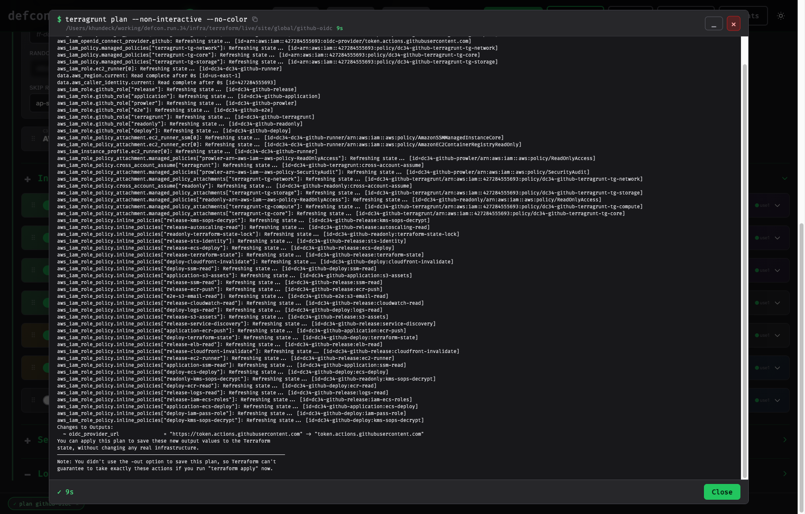

### Fix Locks

The **Fix Locks** button scans all DynamoDB state tables for stuck Terraform locks. It shows a count of found locks with details, then asks for confirmation before removing them.

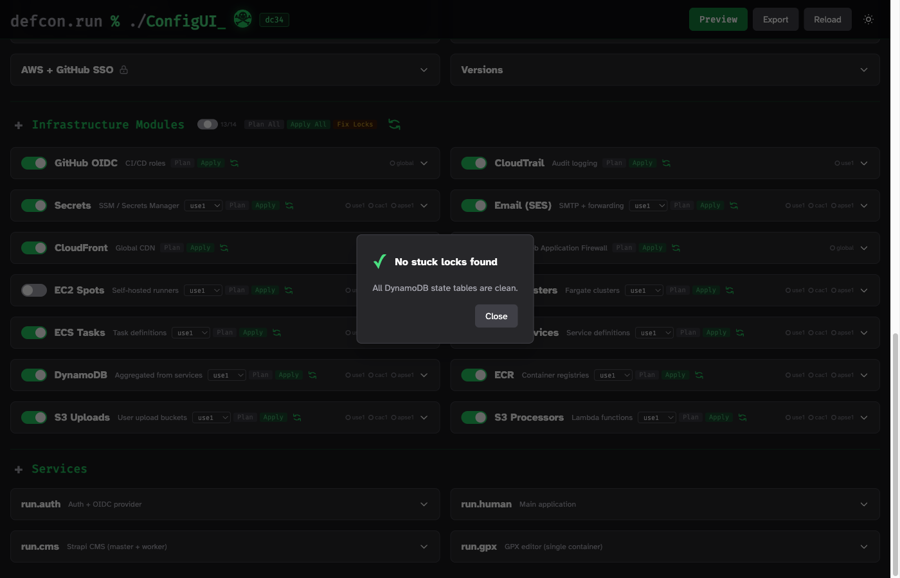

### PII Blur

Sensitive fields (account IDs, SSO URLs, email addresses, random suffix, AWS credentials) are blurred by default. Click any field to reveal it individually.

- **Unblur All** -- reveals all form panel fields (with confirmation dialog)
- **Blur All** -- re-blurs everything
- AWS Status bar (Account + ARN) stays blurred even when Unblur All is active
- The word "All" in the button is itself blurred

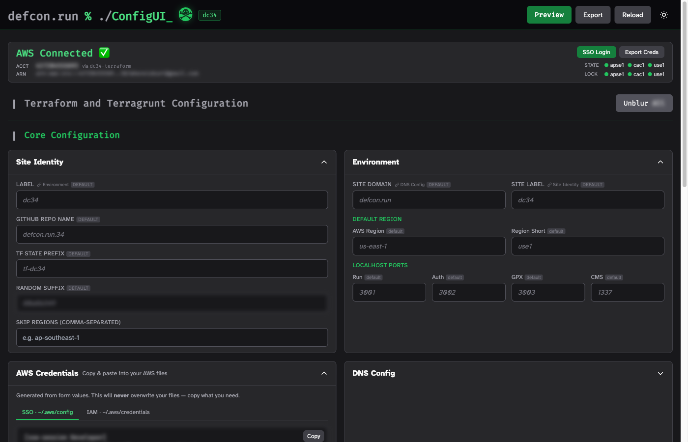

### Field Sync

Duplicate fields across panels stay in sync automatically:

- **Site Label** (Site Identity) syncs with **Site Label** (Environment General)
- **Zone Name** (DNS) syncs with **Site Domain** (Environment General)

A lock icon next to each synced field shows which panel it's linked to.

### AWS Credentials Panel

Generates copy-paste-ready `~/.aws/config` (SSO) and `~/.aws/credentials` (IAM) file content from your form values. Tabbed view with a Copy button on each tab. Content updates live as you change SSO session name, account IDs, and profile prefix.

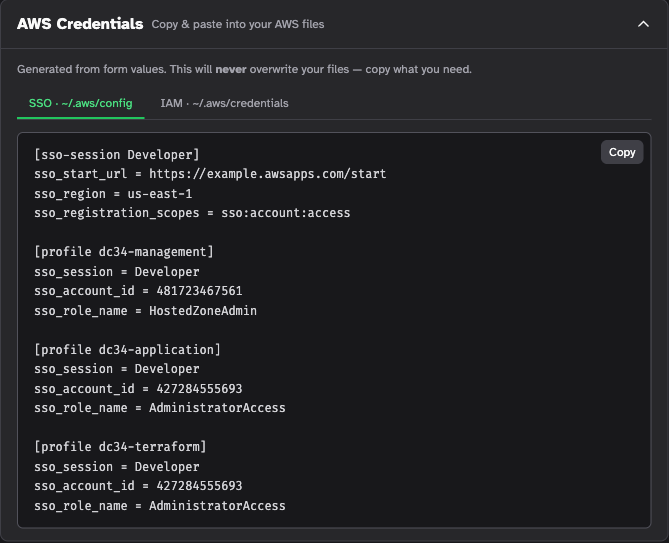

### SOPS Secret Editor

Inline editor for `.secrets.sops.json` -- decrypt, edit key-value pairs, and re-encrypt without leaving ConfigUI. Requires `sops` CLI and AWS KMS key access.

### Default Value Indicators

Fields still holding their default values are dimmed and italicized with a small "default" badge, so you can quickly see what's been customized.

### Export & Backup

- **Export** -- download `site-config.json` as a file
- **Backup** -- automatic timestamped backup created on startup and before every save (backs up site.hcl, service.hcl files, env.sh, env.local.sh, VERSION files)
- **Reload** -- re-import config from disk files

## Architecture

```
apps/configui/
  main.go          # App struct, routes, startup, stdin watcher
  config.go        # SiteConfig struct, defaults, helpers
  handlers.go      # HTTP handlers, form parsing, preview rendering
  generator.go     # HCL/env template rendering and file writing
  import.go        # Parse site.hcl and service.hcl back into config
  envfiles.go      # env.sh / env.local.sh parsing and generation
  discovery.go     # AWS resource existence checks (14 modules)
  terminal.go      # Terragrunt process management, SSE streaming
  locks.go         # DynamoDB lock scanning and removal
  aws.go           # AWS identity, state bucket, lock table checks
  sops.go          # SOPS decrypt/encrypt via CLI
  backup.go        # Timestamped backup creation
  versions.go      # VERSION file reading

  static/
    app.js         # All frontend JS (~1600 lines)
    style.css      # Custom CSS (toggles, blur, discovery, terminal, etc.)
    dcjack.svg     # DC Jack bunny logo

  templates/
    layout.html    # Page shell, header, preview panel, script tags
    form.html      # Form grid, section headers, template includes
    partials/      # 24+ panel templates + aws_status, discovery, env_preview
```

All templates and static files are embedded via `go:embed` -- the binary is self-contained. Changes to templates/CSS/JS require rebuilding.

## API Endpoints

| Method | Path | Purpose |
|--------|------|---------|
| GET | `/` | Main form UI |
| POST | `/save` | Save all config files |
| POST | `/preview` | Generate HCL/env preview |
| GET | `/export` | Download site-config.json |
| GET | `/api/aws-status` | Check AWS auth + state/lock tables |
| POST | `/api/sso-login` | Trigger AWS SSO login |
| POST | `/api/export-creds` | Export AWS credentials |
| POST | `/api/reload` | Reload config from disk |
| GET | `/api/discovery` | Get discovery results |
| POST | `/api/discovery/refresh` | Start discovery scan |
| POST | `/api/sops/edit` | Decrypt SOPS secret |
| POST | `/api/sops/save` | Encrypt and save SOPS secret |
| POST | `/api/terminal/start` | Start terragrunt process |
| GET | `/api/terminal/stream` | SSE stream of terminal output |
| POST | `/api/terminal/stop` | Kill running process |
| POST | `/api/scan-locks` | Scan for stuck locks |
| POST | `/api/fix-locks` | Remove stuck locks |

## Screenshots

Add screenshots to the `docs/` directory:

```
docs/
  overview.png         # Full page with panels visible
  form-panels.png      # Core config panels expanded
  module-toggle.png    # Section toggle with label
  preview-panel.png    # Side-by-side form + HCL preview
  aws-status.png       # AWS Connected bar with dots
  discovery-dots.png   # Panel headers with status dots
  terminal-modal.png   # Terragrunt plan/apply streaming
  fix-locks.png        # Lock scan results dialog
  pii-blur.png         # Blurred vs revealed fields
  aws-credentials.png  # AWS config/credentials tabs
  configui-form-evolution-*.gif  # Form view timelapse
  configui-form-evolution-*.mp4  # Form view timelapse (HD)
  configui-preview-evolution-*.gif  # Preview view timelapse
  configui-preview-evolution-*.mp4  # Preview view timelapse (HD)
```
